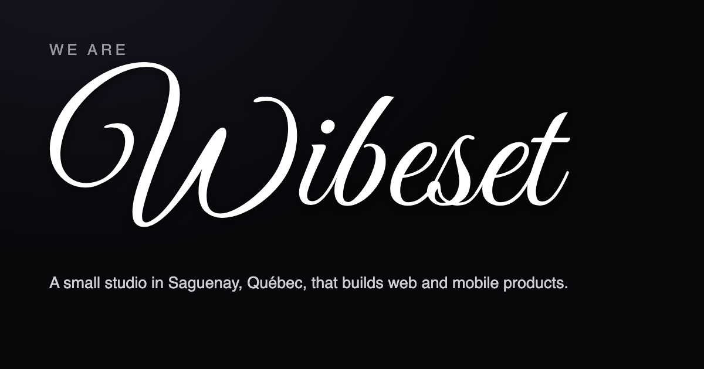

  

<h1 align="center">Wibeset</h1>

  <strong>The calm, fast, private kind.</strong> 
  A small studio in Saguenay, Québec, that builds web and mobile products.

  <a href="https://wibeset.ca"><strong>wibeset.ca →</strong></a>

  <em>Saguenay, Québec · English &amp; French · We ship our own products</em>

---

We build small software that does one thing well, then gets out of the way. No
bloat, no dashboards nobody reads, nothing to configure before it's useful.

Everything here is ours — designed, built and shipped in-house.

## Products

### Puuunch

**A fast, beautiful timesheet for freelancers and small teams.** Log time,
review the week, and send it for approval — without the accounting-software
feel.

*Coming soon.*

### Noue

**A collaborative memory for small teams. Not a CRM.** One principle: one
interaction, one note. A person is a name and a timeline. Built for the small
businesses, agencies and consultants who find HubSpot and Salesforce far too
complex.

*Coming soon.*

### The Chirp League

**Fantasy hockey pools with built-in trash talk.** Draft real NHL players, track
live standings, and chirp your rivals — all in one place.

*Coming soon.*

### Luere

**Smaller files. Same good looks.** Shrink, convert, crop and resize your images
with a live before/after preview, so you decide exactly how much quality to
trade for size. Seven formats, batch export, and a proper crop studio.

Free, native macOS app. Everything runs on your Mac — nothing is ever uploaded.

[luere.app →](https://luere.app)

### Luere Icon Studio

**One logo. Every icon.** Drop in a single image and get every icon and favicon
size you need — web, macOS, iOS and Windows — written to a tidy folder next to
your source.

Free, native macOS app. Everything runs on your Mac.

[luere.app/icon-studio →](https://luere.app/icon-studio/)

## What we care about

- **Calm** — software that doesn't demand attention it hasn't earned.
- **Fast** — if it feels slow, it's broken.
- **Private** — your data is yours. Our Mac apps never upload anything.
- **Bilingual** — everything we ship works in English and French.

## Say hello

Got a question or just want to talk? **[hello@wibeset.ca](mailto:hello@wibeset.ca)**

---

  <a href="https://wibeset.ca">wibeset.ca</a> ·
  <a href="https://wibeset.ca/fr/">Version française</a> ·
  Founded by <a href="https://dominicmartineau.com">Dominic Martineau</a>

